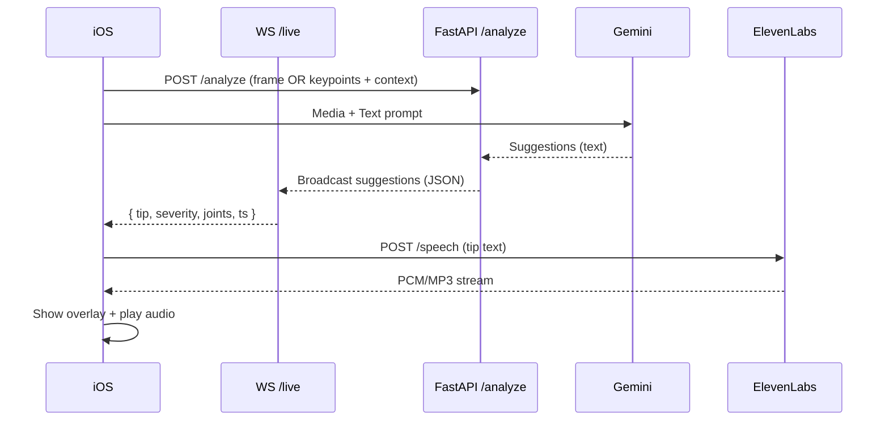

# Tech Stack & Architecture

## Overview

**KineTrack** is an AI-powered physical-therapy assistant that analyzes posture in real time and gives corrective feedback via on-screen tips and voice guidance.

### Core Goals

* **Low latency** feedback (sub-second target)
* **Privacy-aware** (send only what’s needed)
* **Platform-native UX** (clean iOS look & feel)

---

## Stack (by layer)

### iOS App (Swift / SwiftUI)

* **Capture & UI:** `AVFoundation`, `SwiftUI`
* **Realtime transport:** `URLSession` (HTTP) + `URLSessionWebSocketTask` (WebSocket) for live tips
* **AI client helpers:** Gemini requests (see `GeminiAPIFunctions.swift`)
* **TTS client:** ElevenLabs REST (or SDK)
* **Local compute (option):** MediaPipe Pose (on-device) → send **keypoints** instead of raw video to reduce bandwidth & cost

### AI & Services

* **Gemini 2.5 Flash (Vision + Text):** posture assessment + coaching text
* **ElevenLabs:** convert tips to natural speech (streamed back)

### Backend (Python / FastAPI suggested)

* **Endpoints:** `POST /analyze`, `WS /live`, `POST /speech`, `GET /history/:userId`
* **Pipelines:** video frames (or keypoints) → Gemini → suggestion text → broadcast to client(s)
* **Auth & rate limits:** API key vault (server-only), per-user rate limiting
* **Observability:** `uvicorn` access logs, OpenTelemetry/OTLP (optional), Sentry (optional)
X


---

## Realtime Sequence (detail)



---

## Payloads (contracts)

### 1) `POST /analyze`

**Request** (choose one: frames *or* keypoints):

```json
{
  "sessionId": "abcd-1234",
  "mode": "keypoints",
  "frameId": 417,
  "fps": 30,
  "keypoints": [
    { "name": "left_shoulder", "x": 0.42, "y": 0.31, "z": -0.12, "conf": 0.93 },
    { "name": "right_shoulder", "x": 0.61, "y": 0.32, "z": -0.10, "conf": 0.91 }
  ],
  "context": {
    "exercise": "shoulder_external_rotation",
    "sideViewEnforced": true,
    "userGoal": "rehab_form_correction"
  }
}
```

**Response**

```json
{
  "frameId": 417,
  "tips": [
    {
      "text": "Keep your right elbow tucked near your ribs.",
      "severity": "medium",
      "targets": ["right_elbow","right_shoulder"]
    }
  ]
}
```

### 2) `WS /live` (server → client events)

```json
{
  "type": "tip",
  "sessionId": "abcd-1234",
  "tipId": "t-001",
  "text": "Straighten your back. Align shoulders over hips.",
  "severity": "high",
  "confidence": 0.86,
  "joints": ["left_hip","right_hip","spine_upper"],
  "ts": 1712345678
}
```

### 3) `POST /speech`

```json
{
  "text": "Straighten your back and brace your core.",
  "voice": "puck",
  "format": "mp3"
}
```

---

## Swift Touch-Points (where each piece fits)

**Capture & send (simplified):**

```swift
// On each processed frame or at ~10–15 FPS sampling:
let payload = AnalyzePayload(
  sessionId: session.id,
  mode: useKeypoints ? "keypoints" : "frame",
  frameId: frameCounter,
  fps: 30,
  keypoints: kpArray,             // [] if sending frame
  context: Context(exercise: currentExercise, sideViewEnforced: true, userGoal: "rehab_form_correction")
)

try await network.postAnalyze(payload) // -> returns initial tips; stream continues over WS
```

**Live tips over WebSocket:**

```swift
websocket.connect(url: backendLiveURL)
websocket.onMessage = { (event: LiveTipEvent) in
    withAnimation {
        self.overlayTips = event // update UI overlay
    }
    if settings.voiceCoaching {
        elevenLabs.speak(text: event.text) // stream to AVAudioEngine
    }
}
```

**TTS playback (ElevenLabs):**

```swift
func speakTip(_ text: String) async throws {
    let audio = try await elevenAPI.tts(text: text, voice: .puck, format: .mp3)
    try audioPlayer.play(data: audio)
}
```

---

## Backend Skeleton (FastAPI)

```python
# main.py (sketch)
from fastapi import FastAPI, WebSocket
from pydantic import BaseModel
import asyncio

app = FastAPI()
clients = set()

class Keypoint(BaseModel):
    name: str; x: float; y: float; z: float | None = None; conf: float | None = None

class AnalyzeReq(BaseModel):
    sessionId: str
    mode: str  # "keypoints" | "frame"
    frameId: int
    fps: int
    keypoints: list[Keypoint] = []
    context: dict

@app.post("/analyze")
async def analyze(req: AnalyzeReq):
    # Build Gemini prompt using keypoints or frame reference
    # tips = await gemini_infer(req)
    tips = [{"text": "Keep spine neutral.", "severity":"high", "targets":["spine_upper"]}]
    # Fanout to WS subscribers for this session
    payload = {"type":"tip","sessionId":req.sessionId,"tipId":"t-001","text":tips[0]["text"],"severity":"high","confidence":0.85,"joints":["spine_upper"]}
    await broadcast(payload)
    return {"frameId": req.frameId, "tips": tips}

@app.websocket("/live")
async def live(ws: WebSocket):
    await ws.accept()
    clients.add(ws)
    try:
        while True:
            await ws.receive_text()  # (optional ping/pong or client events)
    except:
        pass
    finally:
        clients.remove(ws)

async def broadcast(msg: dict):
    for ws in list(clients):
        try:
            await ws.send_json(msg)
        except:
            clients.discard(ws)
```

---

## Why “keypoints, not frames” (recommended)

* **Bandwidth**: ~ 33 body joints × 4 floats @ 10–15 FPS ⇒ a few KB/s vs. MB/s for video
* **Latency**: smaller payloads → faster round-trip feedback
* **Privacy**: no raw user imagery leaves device (optional)

If you still need video (for certain Gemini prompts), keep it at **low rate** (e.g., 1 FPS thumbnails) and pair with keypoints.

---

## Environment Variables

| Key                  | Where                     | Purpose             |
| -------------------- | ------------------------- | ------------------- |
| `GEMINI_API_KEY`     | Backend only              | Calls to Gemini     |
| `ELEVENLABS_API_KEY` | iOS (Keychain) or Backend | TTS                 |
| `BACKEND_BASE_URL`   | iOS                       | REST base           |
| `BACKEND_LIVE_URL`   | iOS                       | WS endpoint         |
| `DATABASE_URL`       | Backend                   | Postgres connection |

> iOS: store keys in **Keychain** and ship public endpoints via **.xcconfig** (no secrets in Info.plist).
> Backend: load via Secret Manager / env vars (never commit).

